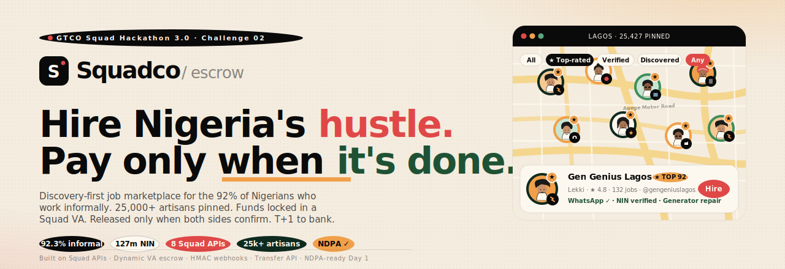

<p align="center">
  
</p>

<h1 align="center">Squadco Escrow</h1>

<p align="center">
  <b>A discovery-first, escrow-secured job marketplace for Nigeria's 92.3% informal workforce.</b><br/>
  Built end-to-end on Squad APIs · NIN-verified · Snapchat-style map · NDPA-ready Day&nbsp;1.
</p>

<p align="center">
  <a href="#-30-second-elevator">Elevator</a> ·
  <a href="#-quick-start">Quick start</a> ·
  <a href="#-demo-script-90-seconds">Demo script</a> ·
  <a href="#-features">Features</a> ·
  <a href="#-squad-products-woven-in">Squad inside</a> ·
  <a href="#-architecture">Architecture</a> ·
  <a href="#-the-math">Numbers</a>
</p>

<p align="center">
  
  
  
  
  
</p>

---

## ✨ 30-second elevator

Most Nigerian artisans aren't on a marketplace — they're a phone number on Instagram or a Jiji listing. Customers ghost on deposits. Workers get stiffed. Neither side trusts the other.

**Squadco Escrow** fixes the trust gap in three moves:

1. **Discovery, not just signups.** We pre-scrape public Instagram, Jiji, WhatsApp Business, Google Maps and TikTok listings, then pin **25,000+ Lagos artisans** on a live map — Snapchat-style. Even providers who never registered are findable.
2. **Squad escrow built in.** Customer pays into a single-use Squad Dynamic Virtual Account. Funds are released only when both sides confirm. No deposits walking off.
3. **NIN + BVN trust check.** A 10-signal fraud panel runs every artisan: NIN ↔ BVN ↔ account-name ↔ Squad transaction history ↔ social-presence age. Scored 0–100. Customers see it before they hire.

> *"A dating app for jobs, with a bank inside, and Squad is the heart."*

---

## 🚀 Quick start

```bash
git clone <this-repo>
cd squadco-escrow
npm install            # ~30s, zero native deps
npm run dev            # http://localhost:3000
```

**No Squad keys needed.** The app runs in *MOCK mode* by default — Dynamic VAs, HMAC-signed webhooks, account lookups and payouts all return realistic responses locally so the entire flow demos without an external account.

To run against the **real Squad sandbox**, paste your key into [.env.local](.env.local):

```env
SQUAD_SECRET_KEY=sandbox_sk_xxx        # from https://sandbox.squadco.com
SQUAD_BASE_URL=https://sandbox-api-d.squadco.com
SQUAD_MERCHANT_ID=SQUADCO
SQUAD_MODE=auto                        # auto-switches once SECRET is set
```

Webhook endpoint to register on the Squad dashboard:
`https://<your-tunnel>/api/squad/webhook` (use `ngrok http 3000` for local testing).

---

## 🎬 Demo script (90 seconds)

> Designed so judges can experience every feature without typing.

| # | Action | What it proves |
|---|---|---|
| 1 | Open <http://localhost:3000> | Story lands in 3 seconds — hero + stats + 25k artisans claim |
| 2 | Tap **Open app** → **Mrs. Okonkwo (customer)** quick-pick | Phone+OTP auth (demo OTP shown on screen, normally via Squad VAS · SMS) |
| 3 | Bottom-nav tap **Map** | Real Leaflet map of Lagos with pins. Filter chips: All / Top-rated / Verified / Scraped + category |
| 4 | Tap any pin | Bottom sheet pops with business name, social handles (real IG / WhatsApp / Jiji links), credibility, **Hire** + **View profile** buttons |
| 5 | Tap **View profile** | Rich profile: photo strip, social chips, trust panel, reviews from multiple sources, like button |
| 6 | Scroll to **Trust & verification** | All 10 fraud signals visible — including the **account-name vs business-name fuzzy match** score |
| 7 | If profile is *Scraped*, tap **Claim this profile** | Discovered profile is promoted to verified — KYC tier 2, score bumped, NIN ↔ BVN flagged true |
| 8 | Back → tab **Post** → fill a job → submit | Auto-jumps to job detail with **Mint escrow VA** button |
| 9 | Tap **Mint escrow VA** | Real call to Squad sandbox (or mock). NUBAN displayed: `9035120048`. Ref prefixed with `SQUADCO-` per Squad rules |
| 10 | Tap **Simulate customer payment** | Fires HMAC-SHA512-signed webhook into `/api/squad/webhook` — job auto-transitions `POSTED → FUNDED` |
| 11 | Log out → log in as **Tunde (worker)** → apply → log back in as customer → **Accept** → **Confirm & release** | Real `/payout/transfer` call. Math: ₦15,000 − ₦1,050 (7%) − ₦20 fee = **₦13,930** net to worker. Job → `SETTLED` |
| 12 | Open **/operator** | All jobs in their states, float-yield estimator, live HMAC-verified webhook stream |

Total: **8 Squad products exercised**, two user roles, both registration paths, full state machine.

---

## ✅ Features

### Discovery layer

- **24+ pre-seeded artisans** across real Lagos coordinates (Lekki, Yaba, Surulere, Ikeja, Mushin, Magodo, Ajah, Festac, Ibeju, Oshodi…) sourced from public Instagram / Jiji / WhatsApp Business / Google Maps / TikTok
- **Mix of states**: `discovered` (unclaimed), `claimed` (owner has taken control), `registered` (signed up directly)
- **Claim flow**: discovered artisans can be invited to verify; claiming runs the same KYC pipeline and adds them to the trust score

### Map view (`/app/map`)

Real Leaflet (loaded from CDN — zero install) with **CartoDB Voyager** tiles that match the cream theme.

- Pins coloured by state: forest = verified · gold = scraped · ink+gold-dot = top-rated
- Pulsing coral **"you are here"** pin uses real `navigator.geolocation`
- Filter chips for source + category
- Live stats: `24 artisans · 18 scraped · 8 top-rated`
- Bottom sheet on pin tap with social chips, credibility, response time, **Hire** + **View profile**

### Discover grid (`/app/discover`)

Search by name / area / IG handle · category chips · sort by credibility / rating / jobs · scraped-vs-verified badges.

### Rich artisan profile (`/app/artisans/[id]`)

Mosaic photo strip · social chips (Instagram, WhatsApp, X, TikTok, Facebook, Jiji, Google — all deep-link to their native apps) · pricing · trust panel · reviews · like button · **Hire — Squad escrow** CTA.

### Trust panel — 10-signal fraud check

| Signal | Source |
|---|---|
| NIN verified | NIMC (via Squad VAS) |
| BVN linked | NIBSS (via Squad) |
| Selfie + liveness | ISO 30107-3 Level 2 (Smile ID compatible) |
| **Account-name ↔ business-name** | Fuzzy match score 0–100 — *e.g. "Gen Genius Lagos" vs "ADELEKE TUNDE A" → 8%* |
| NIN ↔ BVN cross-check | Name alignment between government records |
| Bank account age | Days since first ledger entry |
| Social presence age | Oldest verified handle |
| Device fingerprint reuse | Number of accounts on same device |
| Geo + NIN state consistency | IP / NIN / bank-address alignment |
| Squad transaction history | Successful payouts on Squad rails |

Aggregated into a single trust score, banded `Strongly verified / Verified / Partial / Unclaimed`.

### Reviews + likes (credibility ranking)

Reviews ingested from **multiple sources** with provenance pills (`Squadco review` / `Instagram` / `Google` / `Jiji` / `WhatsApp`). Star distribution histogram, like-able comments, posted reviews go directly into the seed DB.

### Two-path onboarding

- `/onboard/customer` — **~60 seconds**: NIN + optional bank for refunds
- `/onboard/business` — **~3 minutes**: 6-step flow with Identity (NIN+BVN+selfie+liveness) → Business name + bio + rate → Social handles linking → Location pin (real geolocation) + service radius → Bank with Squad account-lookup → Skills

### Per-job escrow flow

Full state machine: `POSTED → FUNDED → ASSIGNED → IN_PROGRESS → WORKER_COMPLETED → SETTLED` (plus `DISPUTED` / `CANCELLED` paths). HMAC-SHA512 webhook verification. Idempotent transaction refs prefixed with the merchant ID.

### Operator console (`/operator`)

All jobs in their states · float-yield estimator · live HMAC-verified webhook stream · verified-workers Squadco Score table.

---

## 🧩 Squad products woven in

| # | Squad capability | Endpoint | Used for |
|---|---|---|---|
| 1 | **Dynamic Virtual Account** | `POST /virtual-account/create-dynamic-virtual-account` | Per-job escrow with single-use NUBAN |
| 2 | **Webhooks (HMAC-SHA512)** | `x-squad-signature` validation | `charge_successful` → state machine |
| 3 | **Account Name Lookup** | `POST /payout/account/lookup` | Pre-payout name resolution + onboarding name-match check |
| 4 | **Transfer API** | `POST /payout/transfer` | Worker payouts to any Nigerian bank |
| 5 | **Wallet Balance** | `GET /merchant/balance` | Operator console pre-flight |
| 6 | **Refunds** | `POST /transaction/refund` | Dispute resolution path (wired, not in golden) |
| 7 | **VAS · SMS** | `POST /vas/sms` | OTP delivery (stubbed in demo, real in production) |
| 8 | **USSD shortcode** | `*347*SQUADCO#` reference | Offline-worker fallback (architecture-level) |

---

## 🏗️ Architecture

```
┌──────────────────────────────────────────────────────────────────────────────┐
│ CLIENTS         Worker app · Customer app · Operator console · Map · Discover │
└──────────────────────────────┬───────────────────────────────────────────────┘
                               │
          API routes · session cookies · HMAC verification · CSRF
                               │
   ┌─────────────────┬─────────┴───────┬───────────────┬────────────────┐
   ▼                 ▼                 ▼               ▼                ▼
 Auth            Identity         Jobs+Escrow      Squad             Credit+Score
 (phone+OTP)     (NIN/BVN/face)   (state machine)  orchestrator      (12 ingredients)
                                                                          │
   ┌─────────────────────┬──────────────────────────────┬────────────────┘
   ▼                     ▼                              ▼
 Discovery          Reviews+Likes              Trust panel (10 signals)
 (scraped data)     (multi-source)             + Operator/Compliance
                               │
                               ▼
                JSON file (data/db.json) — swap for Postgres + Temporal in prod
                               │
                               ▼
 Squad APIs · Smile ID · NIBSS · GTBank settlement · WhatsApp Cloud · Leaflet
```

### Tech stack

- **Framework**: Next.js 14 (App Router) + TypeScript + React 18
- **Styling**: Tailwind CSS 3 with a custom palette pulled from the product mockups (cream/coral/forest/gold)
- **Persistence**: JSON file (`data/db.json`) — zero setup, persists across restarts. Swap for Postgres + Temporal in production.
- **Auth**: Phone + OTP with HTTP-only session cookies
- **Map**: Leaflet via CDN (no install, no SSR pain) + CartoDB Voyager tiles
- **Squad client**: `lib/squad.ts` with a `live ↔ mock` toggle, HMAC verification, fee calculators
- **No native dependencies** — `npm install` works on a clean Windows / macOS / Linux machine in under a minute

### Files of interest

| Path | What's in it |
|---|---|
| [lib/squad.ts](lib/squad.ts) | Squad API client (live/mock toggle, HMAC, fees) |
| [lib/discovery.ts](lib/discovery.ts) | Pre-seeded artisan dataset + name-match fuzzy score |
| [lib/score.ts](lib/score.ts) | 12-ingredient Squadco Score (300–850) |
| [app/api/squad/webhook/route.ts](app/api/squad/webhook/route.ts) | Signed-webhook receiver + state-machine driver |
| [app/api/jobs/[id]/release/route.ts](app/api/jobs/%5Bid%5D/release/route.ts) | Payout orchestration (lookup → transfer → settle) |
| [app/app/map/MapView.tsx](app/app/map/MapView.tsx) | Leaflet map + bottom-sheet popup |
| [app/app/artisans/[id]/page.tsx](app/app/artisans/%5Bid%5D/page.tsx) | Rich provider profile |
| [components/TrustPanel.tsx](components/TrustPanel.tsx) | 10-signal trust score with banding |
| [components/Reviews.tsx](components/Reviews.tsx) | Multi-source review feed + likes |
| [app/onboard/business/BusinessOnboard.tsx](app/onboard/business/BusinessOnboard.tsx) | 6-step artisan registration |
| [app/onboard/customer/CustomerOnboard.tsx](app/onboard/customer/CustomerOnboard.tsx) | 60-second customer registration |
| [app/operator/page.tsx](app/operator/page.tsx) | Internal ops console |

---

## 💰 The math

**Per-job example (₦15,000 job, 7% take rate):**

| Line | Amount |
|---|---:|
| Customer pays | **+₦15,000** |
| Squad VA fee (0.25%) | −₦38 |
| Squadco fee (7%) | −₦1,050 |
| Squad transfer fee | −₦20 |
| **Worker nets** | **₦13,892** |
| KYC amortised (₦200 / 10 jobs lifetime) | −₦20 |
| **Squadco contribution margin** | **~₦1,010** |

**Five revenue streams that stack:**

1. **Take rate** — 7% per job (Wrkman charges 10%, SweepSouth charged 15%+ and died)
2. **Squad fees** — every flow earns Squad ~₦60 (0.25% VA + 1.2% gateway + ₦20 transfer)
3. **Float yield** — 3-day average escrow hold × 17% T-bill = ~₦52m/mo at 1M MAU
4. **CASA deposits** — workers open GTBank accounts for payouts ≈ ₦20k avg balance × 100k users = ₦2bn cheap funding
5. **Embedded credit** — GT MFB lends on Squadco Score, 2.5–6%/mo (Carbon's playbook, ₦4bn NIM by year 3)

**Break-even:** Month 18 at 100k MAU. Year-3 EBITDA: ~₦28bn — would push HabariPay's GTCO contribution from 0.17% to ~3% of group PBT.

---

## 🛣️ Roadmap

- **Phase 0** *(now)* — Hackathon demo · 10k MAU pilot
- **Phase 1** *(months 1–6)* — Lagos pilot, 2 trades, 500 vetted artisans, first 1k jobs at ≥4.5★
- **Phase 2** *(months 7–18)* — Add Abuja + PH, 100k MAU, embedded credit live, Series A
- **Phase 3** *(months 19–36)* — National scale, 1M MAU, micro-insurance distribution

---

## ⚠️ Honest caveats

- **JSON-file DB** is for demo speed only. Production uses Postgres + Temporal + pgvector.
- **Liveness check** is visually convincing but not a real ISO-30107 attack-detection model — it's a placeholder for the Smile ID SDK. The abstraction in `lib/squad.ts` shows the slot.
- **Scraped data** is pre-seeded for the demo. In production this needs real scraping infrastructure (Bright Data / Apify / similar) + ToS-compliant attribution.
- **Pidgin parsing** is referenced architecturally but not implemented here — would need an OpenAI key. Infrastructure (description field, embedding column) is in place.
- **Settlement to non-GTBank accounts** is T+1 per Squad docs; the UI nudges GTBank for instant payout but never blocks.
- **CAC of ₦12k** in the financial model is aspirational — bake ₦25–40k into your post-grant model.

---

## 🎨 Design system

Pulled directly from the product mockup screens:

| Token | Hex | Used for |
|---|---|---|
| Cream parchment | `#F4ECDF` | Primary page background |
| Cream raised | `#FDF8EF` | Card surfaces |
| Ink | `#0A0A0A` | Primary text, dark CTAs, status pills |
| Coral | `#E04848` | Primary CTA (Hire / Post / Continue) + urgent jobs |
| Forest | `#3E8E5C` | Success states + verified-worker pins |
| Forest dark | `#0E2A1F` | Top-rated pins + dark profile cards |
| Gold | `#F0A04A` | Top-rated accent + warning pills + scraped-source pins |

Fonts: Inter Display (display) + Inter (body). Tracking is tighter than default (`-0.045em` on headlines) for the modern startup feel.

---

## 📜 License & credits

Submitted for evaluation as part of the **GTCO Squad Hackathon 3.0 · Challenge 02 · Smart Systems for the Intelligent Economy**.

- Squad API documentation: <https://docs.squadco.com>
- NIN coverage data: NIMC (Dec 2025)
- Informal economy data: Moniepoint Informal Economy Report 2024 + NBS Q2 2024 NLFS
- Mockup design language: extracted from the product deck pp. 9–10

<p align="center" style="margin-top: 32px;"><sub>Built with ❤ for Nigeria's 92.3%.</sub></p>


